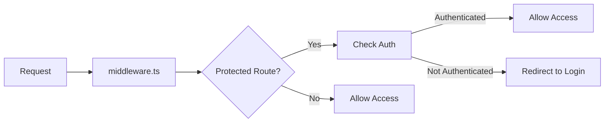
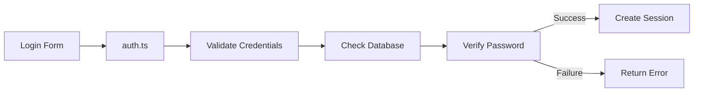

## Next.js App Router Course - MySQL Version

This is a modified version of the Next.js App Router Course dashboard application, adapted to use MySQL instead of PostgreSQL.

## Quick Start

1. Clone the repository
2. Install dependencies:

	$ pnpm i

3. Set up MySQL database using Docker:

	$ docker compose up -d

4. Create `.env` file:

	$ cp .env.example .env

5. Run the development server:

	$ pnpm dev # or npm run dev

6. Seed the database:

	$ node scripts/seed.js

## Database Access

- **MySQL Database**: localhost:3306
  - Username: admin
  - Password: admin123
  - Database: nextjs_dashboard

- **PHPMyAdmin**: http://localhost:5050
  - Server: db
  - Username: admin
  - Password: admin123

## Project Structure

- `/app`: Directory - Main Application Code
	- Core application structure using Next.js App Router
	- Contains routes, layouts, and page components
	- Example: page.tsx contains the landing page with Acme logo and login button
- `/app/lib`: Directory - Core Utilities
	- `data.ts`: Database query functions
		- `fetchRevenue()`: Gets revenue data
		- `fetchLatestInvoices()`: Gets recent invoices
		- `fetchCardData()`: Gets dashboard statistics
	- `actions.ts`: Server actions for form handling
		- `createInvoice()`: Handles invoice creation
	- `definitions.ts`: TypeScript type definitions
		- Defines interfaces for Users, Customers, Invoices, etc.
	- placeholder-data.ts: Sample data for development
- `/app/ui`: UI components (cards, tables, forms)
	- `/dashboard`: Dashboard-specific components
			- `cards.tsx`: Statistics display cards
			- `latest-invoices.tsx`: Recent invoices list
	- `/invoices`: Invoice-related components
		- `table.tsx`: Invoice listing table
	- Common UI elements like buttons, forms, etc.
- `/public`: Static assets
	- Images (like hero-desktop.png, hero-mobile.png)
	- Customer profile pictures
	- Other static resources
- `/scripts`: Database seeding and utility scripts
	- `mysql-local.js`: Database connection management
		- Creates singleton MySQL connection
		- Handles SQL template literals
		- Manages connection errors
	- `seed.js`: Database seeding functionality
		- Creates database tables
		- Populates initial data

## Configuration Files

- `docker-compose.yml`: MySQL and PHPMyAdmin container configuration
- `next.config.js`: Next.js configuration
- `.env`: Environment variables (database connection, auth)

## Database Migration

If you need to reset the database:

1. Stop the application
2. Remove existing containers and volumes:

	$ docker compose down -v

3. Start fresh containers:

	$ node scripts/seed.js

## Authentication

Email: user@nextmail.com
Password: 123456

## References

- [Next.js Documentation](https://nextjs.org/docs)
- [MySQL Documentation](https://dev.mysql.com/doc/)
- [Original Course](https://nextjs.org/learn/dashboard-app)

## Version Information

- Next.js: ^14.0.0
- Node.js: >=18.17.0
- MySQL: 8.0
- Docker Compose: v2.x

## Last Updated

10/2024

## Notes

This is a modified version of the original Next.js dashboard example, adapted to use MySQL instead of PostgreSQL. The core functionality remains the same, but the database layer has been updated to work with MySQL.

## Troubleshooting

If you encounter database connection issues:
1. Ensure Docker containers are running: `docker-compose ps`
2. Check container logs: `docker-compose logs db`
3. Verify `.env` configuration matches Docker settings
4. Try restarting containers: `docker-compose restart`

## Development Tips

- Use PHPMyAdmin to inspect database structure and data
- Check Docker container status with `docker-compose ps`
- Monitor logs with `docker-compose logs -f`

## Database Seeding

To seed the database:

	$ node scripts/seed.js

## Create a git commit message with ChatGPT

	$ git diff > last-changes.log

## The authentication flow

1. Request Flow:

2. Login Flow:

**https://mermaid.live/** for previewing the flowcharts

3. Protection Logic:
   
- `middleware.ts` intercepts requests
- Checks `auth.config.ts` rules
- Uses `auth.ts` to verify session
- Handles redirects if needed

4. Heriicons 
   
- https://heroicons.dev/